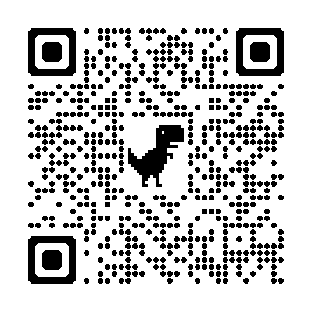

# 杨锟 / Skyler Yang

> 复杂到不能被一句话概括，所以我把想法做成作品。

我是杨锟，也叫宝剑。古有锟铻，山出良铁，可铸宝剑；这个名字后来慢慢变成了我的个人符号。

我现在关心的是：怎样把前沿 AI 想法做成可体验、可上线、可复盘的产品。 
我在产品判断和工程实现之间来回工作，写 PRD，也写代码；做原型，也做交付；喜欢把一个模糊的念头磨到别人真的能点开、试用、反馈。

  
  
  

  
   
  Scan to open my personal portfolio

## Featured Work

- [Fit Genius](https://github.com/swording-k/fit-genius) - AI 健身训练助手，尝试把训练计划、动作分析、饮食建议和阶段复盘组织成一个更容易坚持的 iOS 体验。
- [Codex Zen Character](https://github.com/swording-k/codex-theme-creator) - 一句话或一张参考图，让 Codex 为 macOS Codex Desktop 创作、安装并验证一套完整主题。
- [个人网站 / Personal Site](https://swording-k.github.io) - 我的个人作品集与工作台，围绕“宝剑”这个个人符号，展示 AI 产品、iOS 应用、浏览器交互项目和个人经历。
- [The Last Bookstore](https://github.com/swording-k/the-last-bookstore) - 一个浏览器可玩的 AI 叙事项目，关于记忆、书店，以及数字世界崩塌后还想留下什么。

## Open Source Signals

我以贡献者身份持续参与 [Atoll](https://github.com/Ebullioscopic/Atoll)（macOS 灵动岛开源项目），已合并多个 PR 并提交产品提案，后续将成为项目 collaborator。点进仓库即可在右侧 contributor 列表中看到我。

  
  
  

- **Atoll** · [Dynamic Island for macOS](https://github.com/Ebullioscopic/Atoll)
  - 💡 产品提案（[#539](https://github.com/Ebullioscopic/Atoll/issues/539)）：为本地 AI coding agent 提出监控与管理中心，覆盖用户场景、MVP、隐私原则与技术路线。
  - 🔧 Bug 修复（[#544](https://github.com/Ebullioscopic/Atoll/pull/544)，已合并）：修复非英语环境下统计弹窗因本地化标题匹配失败的问题。
  - 🔧 Bug 修复（[#566](https://github.com/Ebullioscopic/Atoll/pull/566)，已合并）：修复全天事件/提醒存在时日历自动滚动失效的问题。

## GitHub Dashboard

  
  

  

## 正在探索

- AI-native 产品体验
- iOS / SwiftUI 应用
- LLM API 与 AI agent workflow
- 浏览器可玩的交互叙事
- 用更快的原型速度验证真实产品判断

## 链接

- Website: [swording-k.github.io](https://swording-k.github.io)
- GitHub: [@swording-k](https://github.com/swording-k)
- Email: [swordingk@gmail.com](mailto:swordingk@gmail.com)

<strong>English version</strong>

# Skyler Yang

> Too complex to summarize, so I turn ideas into things people can actually try.

I am Yang Kun, also known as Baojian. The name comes from Kunwu, a mountain associated with fine iron and sword-making; over time, that became a personal symbol for how I think about craft.

I care about one practical question: how do we turn frontier AI ideas into products that can be experienced, shipped, and reflected on? 
I work between product judgment and engineering execution. I write PRDs and code, shape prototypes and ship interfaces, and push vague ideas far enough that someone can open them, use them, and respond.

## Featured Work

- [Fit Genius](https://github.com/swording-k/fit-genius) - an AI fitness assistant that brings training plans, movement analysis, nutrition guidance, and progress review into a more adaptive iOS experience.
- [Codex Zen Character](https://github.com/swording-k/codex-theme-creator) - generate, install, and verify a complete theme for macOS Codex Desktop from a single sentence or a reference image.
- [Personal Site](https://swording-k.github.io) - my portfolio and personal workbench, built around the Baojian symbol and my work across AI products, iOS apps, browser-based projects, and personal storytelling.
- [The Last Bookstore](https://github.com/swording-k/the-last-bookstore) - a browser-playable AI narrative about memory, books, and what remains after a digital world collapses.

## Open Source Signals

I contribute to [Atoll](https://github.com/Ebullioscopic/Atoll) (an open-source Dynamic Island for macOS) as a recurring contributor — multiple merged PRs and a product proposal, with collaborator access coming up. Open the repo to see me in the contributor list on the right.

- **Atoll** · [Dynamic Island for macOS](https://github.com/Ebullioscopic/Atoll)
  - 💡 Product proposal ([#539](https://github.com/Ebullioscopic/Atoll/issues/539)): a monitoring and management center for local AI coding agents, covering user scenarios, MVP, privacy principles, and the technical roadmap.
  - 🔧 Bug fix ([#544](https://github.com/Ebullioscopic/Atoll/pull/544), merged): fixed stats popovers failing to match localized graph titles in non-English locales.
  - 🔧 Bug fix ([#566](https://github.com/Ebullioscopic/Atoll/pull/566), merged): fixed calendar auto-scroll breaking when all-day events/reminders are present.

## Exploring

- AI-native product experiences
- iOS and SwiftUI apps
- LLM APIs and agent workflows
- Browser-playable interactive narratives
- Fast prototypes for sharper product judgment

## Links

- Website: [swording-k.github.io](https://swording-k.github.io)
- GitHub: [@swording-k](https://github.com/swording-k)
- Email: [swordingk@gmail.com](mailto:swordingk@gmail.com)

